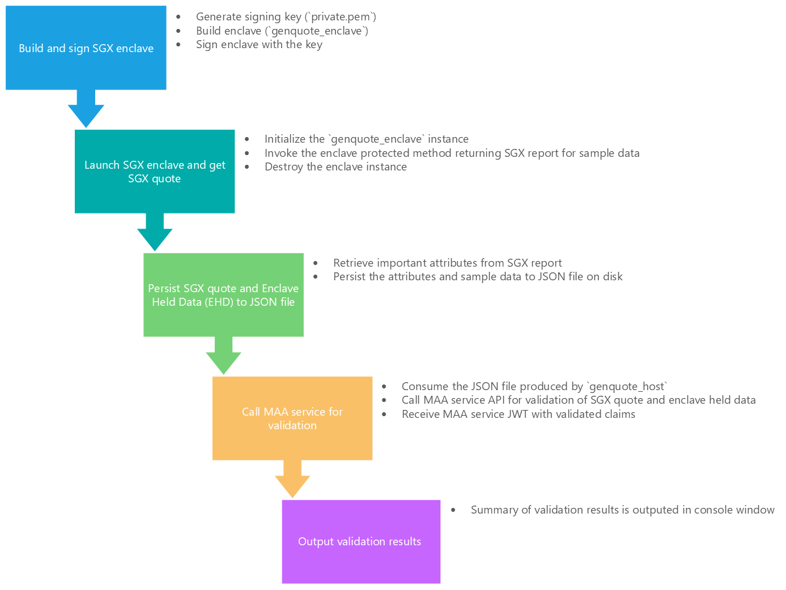

## Sample code for Intel® SGX Attestation using Microsoft Azure Attestation service and Intel® SGX SDK for Linux OS

### References
* The sample, including code, design and documentation, is derived from the [Sample code for Intel® SGX Attestation using Microsoft Azure Attestation and Open Enclave SDK for Linux OS](https://github.com/Azure-Samples/microsoft-azure-attestation/tree/master/sgx.attest.sample) and follows its execution flow
* The SGX enclave and host code in this sample is derived from the [Intel® Software Guard Extensions Data Center Attestation Primitives (Intel® SGX DCAP) Quote Generation SampleCode](https://github.com/intel/SGXDataCenterAttestationPrimitives/tree/master/SampleCode/QuoteGenerationSample)
* Intel® Software Guard Extensions (Intel® SGX) Data Center Attestation Primitives (Intel® SGX DCAP): https://github.com/intel/SGXDataCenterAttestationPrimitives
* Intel® Software Guard Extensions for Linux* OS: https://github.com/intel/linux-sgx

### Overview

The Azure Attestation SGX sample code demonstrates how to generate a quote in an SGX enclave and then get it validated by the Microsoft Azure Attestation (MAA) service. The "enclave held data" for the quote for simplicity is populated with sample data represented as `uint8_t` array.

The execution flow in the sample code are outlined in the following diagram:


=======

The flow is:
1. ```genquote_enclave``` - This application is an SGX enclave created via the Intel® SGX SDK. It exposes one ECALL to retrieve a remote quote for enclave held data.
    1. Generate signing key (`private.pem`)
    1. Build enclave (`genquote_enclave`)
    1. Sign enclave with the key
1. ```genquote_host``` - This application is run first and performs the following:
    1. Initializes and launches the `genquote_enclave` SGX enclave instance
    1. Invokes the enclave protected method (ECALL) to retrieve a remote quote for hashed (SHA256) enclave held data, which in this case is a `uint8_t` static array
    1. Retrieves important attributes from the SGX report, such as Security Version Number, ProductID, MRSIGNER, MRENCLAVE, etc.
    1. Persists the remote quote, enclave held data and parsed report fields to a JSON file on disk
1. ```validatequotes.core``` - This application is built on .NET core and runs on any platform. It consumes the JSON file persisted by the ```genquote_host``` application and performs the following:
    1. Calls the Azure Attestation service for validation, passing it the remote quote and enclave held data found in the JSON file
    1. Validates that the Azure Attestation JWT passes signature validation and is issued by the expected party
    1. Validates that the Azure Attestation JWT claim values match the parsed data in the JSON file for the well known fields like Security Version Number, ProductID, MRSIGNER, MRENCLAVE, etc.
    1. Produces a report in the console with the results

### Quote Generation

Remote quote generation is performed by the following call to the ```sgx_create_report``` method in the [ecall.cpp](./genquotes/enclave/ecalls.cpp) file in the ```genquote_enclave``` application.

```
sgx_status_t sgx_create_report(
    const sgx_target_info_t *target_info,
    const sgx_report_data_t *report_data,
    sgx_report_t *report
);

```

### Remote Quote Validation via MAA Attestation

The MAA service is called to perform attestation by the following call in the [MaaService.cs](./validatequotes.core/MaaService.cs#L32) file:

```
    // Send request
    var response = await theHttpClient.SendAsync(request);
```

The verification that the MAA service JWT passes signature validation and is issued by the expected issuer is in the [JwtHelperValidation.cs](./validatequotes.core/Helpers/JwtValidationHelper.cs#L22) file:
```
    public static TokenValidationResult ValidateMaaJwt(string attestDnsName, string serviceJwt)
```

The verification that the MAA service JWT claims match the initial parsed report data is performed in the [EnclaveInfo.cs](./validatequotes.core/EnclaveInfo.cs#L31) file:
```
    public void CompareToMaaServiceJwtToken(string serviceJwtToken, bool includeDetails)
```

### How to Build and Run

##### 1. Prerequisites/System setup
1. Install Ubuntu 18.04 on an [Azure Confidential Computing](https://azure.microsoft.com/en-us/solutions/confidential-compute/) VM.
2. Install Intel SGX Driver and SGX SDK.

Configure the Intel and Microsoft APT Repositories:
```
echo 'deb [arch=amd64] https://download.01.org/intel-sgx/sgx_repo/ubuntu bionic main' | sudo tee /etc/apt/sources.list.d/intel-sgx.list
wget -qO - https://download.01.org/intel-sgx/sgx_repo/ubuntu/intel-sgx-deb.key | sudo apt-key add -
echo "deb [arch=amd64] https://packages.microsoft.com/ubuntu/18.04/prod bionic main" | sudo tee /etc/apt/sources.list.d/msprod.list
wget -qO - https://packages.microsoft.com/keys/microsoft.asc | sudo apt-key add -
```

Install Intel SGX DCAP Driver:
```
sudo apt -y update
sudo apt install -y dkms
wget https://download.01.org/intel-sgx/sgx-dcap/1.4/linux/distro/ubuntuServer18.04/sgx_linux_x64_driver_1.21.bin -O sgx_linux_x64_driver.bin
sudo chmod a+x sgx_linux_x64_driver.bin
sudo ./sgx_linux_x64_driver.bin
```
For more information see: https://github.com/intel/linux-sgx#build-and-install-the-intelr-sgx-driver .

Install Intel SGX SDK: 
```
wget https://download.01.org/intel-sgx/sgx-dcap/1.4/linux/distro/ubuntuServer18.04/sgx_linux_x64_sdk_2.8.100.3.bin -O sgx_linux_x64_sdk.bin
sudo chmod a+x sgx_linux_x64_sdk.bin
sudo ./sgx_linux_x64_sdk.bin
# Specify directory to intall Intel SDK. For example, /opt/intel
# if the SDK is installed into /opt/intel, run the following command
echo "source /opt/intel/sgxsdk/environment" >> ~/.bashrc && source ~/.bashrc
```
For more information see: https://software.intel.com/content/www/us/en/develop/topics/software-guard-extensions/sdk.html

Install SGX libraries:
```
sudo apt install -y libssl-dev libsgx-quote-ex libsgx-enclave-common libsgx-enclave-common-dev libsgx-dcap-ql libsgx-dcap-ql-dev az-dcap-client
```

3. Install the [.NET CORE SDK](https://docs.microsoft.com/en-us/dotnet/core/install/linux-ubuntu) for Ubuntu 18.04 on this VM.

##### 2. Build and Run
1. ```git clone ``` this repo to the VM
1. ```cd``` to the subdirectory containing this sample code
1. To build, run and generate the JSON files do the following:
    1. ```cd genquotes```
    1. ```./runall.sh```
    1. This runs the application in four different enclave configurations to generate four different remote quotes.  You should see four new files created in the ```./genquotes/out``` directory.
1. To build, run and validate the JSON files with the MAA service do the following:
    1. ```cd validatequotes.core```
    1. ```./runall.sh```
    1. This builds and runs the validation application against the four different JSON files produced earlier.
    1. The runall.sh script assumes you have access to the `sharedcus.cus.attest.azure.net` attestation provider.  If you don't, edit the [runall.sh](./validatequotes.core/runall.sh#L5) script to reference your attestation provider.  

##### The four different JSON files are:
* *enclave.info.debug.json* - debugging enabled
* *enclave.info.release.json* - debugging disabled
* *enclave.info.securityversion.json* - security version set to 8888
* *enclave.info.prodid.json* - product id set to 9999

